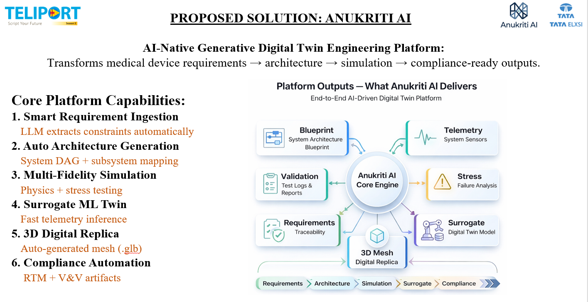
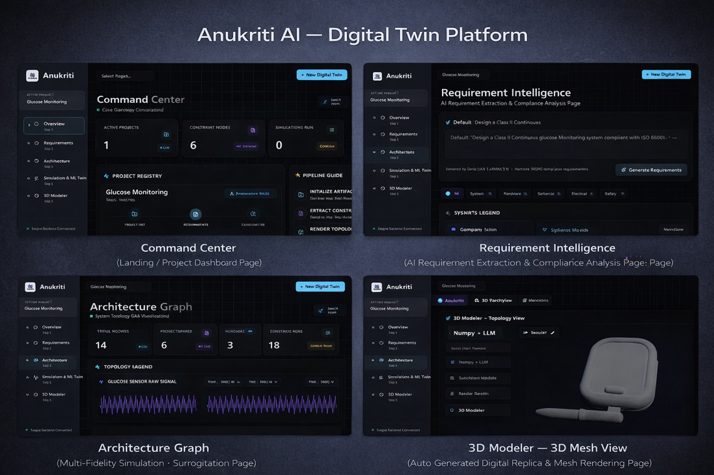
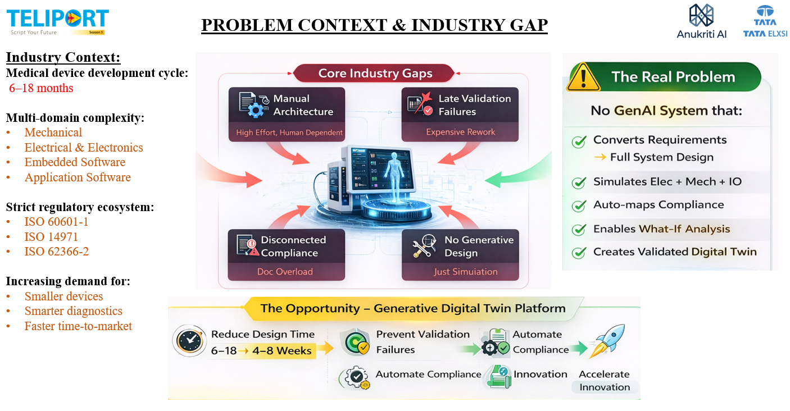
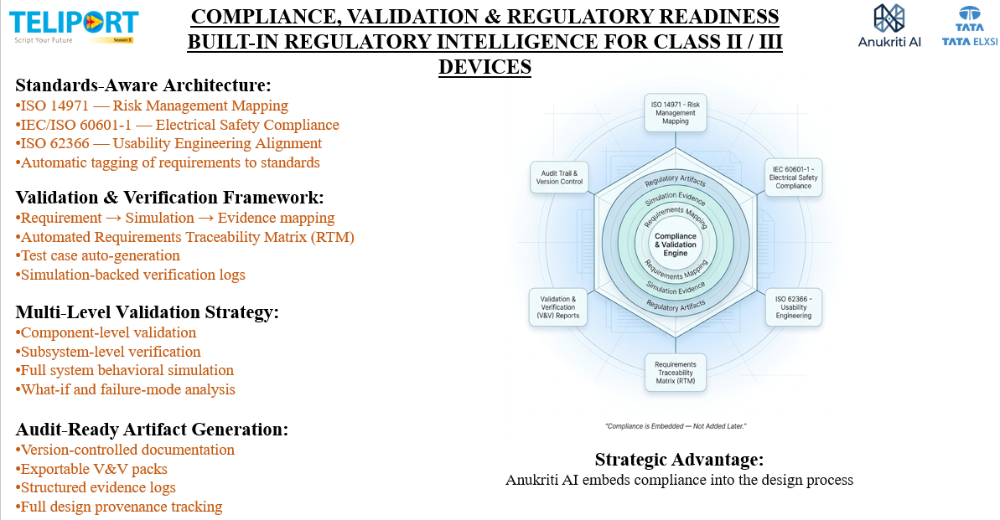
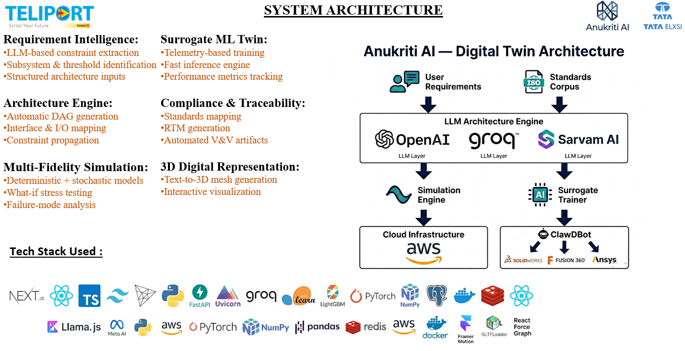
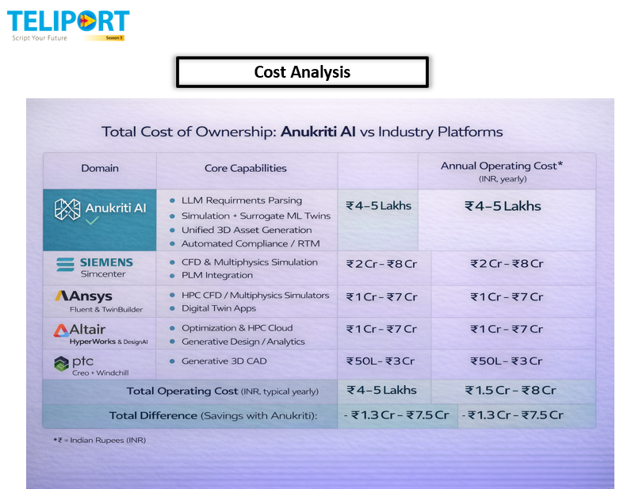
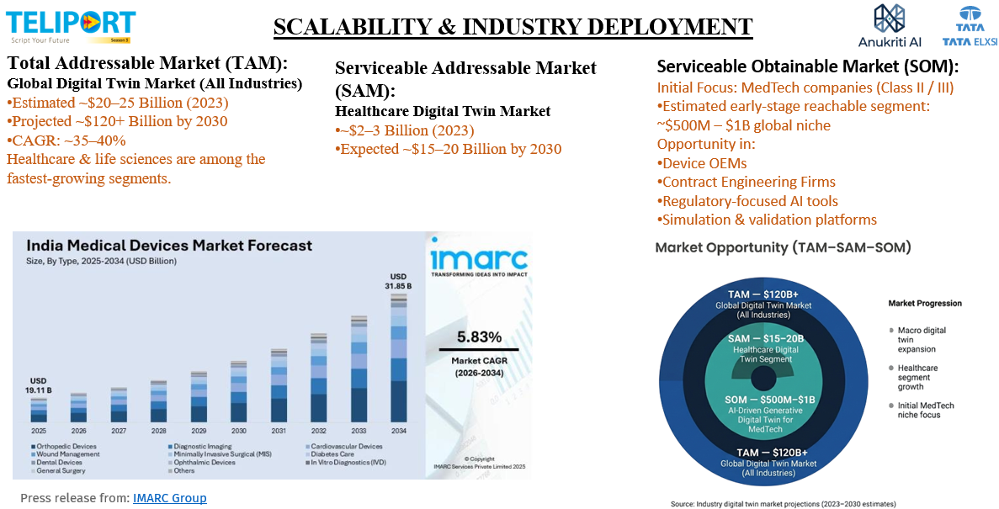
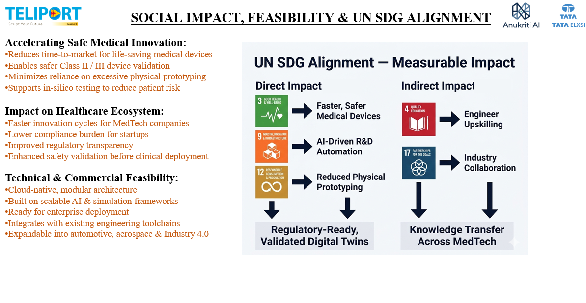

<div align="center">

# 🧠 Anukriti AI — Generative System Engineering & Digital Twin Platform

### *Translate Abstract Device Requirements into Physics-Simulated, ML-Surrogate Digital Twins for Medical Devices*

<br>

🌐 **[Live Demo Deployment (Vercel)](https://anukriti-ai.vercel.app/)** &nbsp;|&nbsp; 🎬 **[MVP Demo Video (LinkedIn)](https://www.linkedin.com/feed/update/urn:li:activity:7462216246554550272/)**

<br>



<br><br>

[](https://nextjs.org)
[](https://fastapi.tiangolo.com)
[](https://python.org)
[](https://groq.com)
[](https://docker.com)
[](LICENSE)

<br>

**Anukriti AI is an end-to-end generative engineering and digital twin platform that translates natural language device requirements into physics-validated, ML-surrogate digital twins. Developed for mission-critical medical devices, the platform automates system topology generation (DAGs), cascading numerical physics simulations (thermal, electrical, battery, fluid), real-time compliance mapping (IEC 60601-1, ISO 13485), and interactive 3D digital replicas to compress development cycles from months to weeks.**

[✨ Highlights](#-highlights) · [💡 Why Anukriti AI?](#-why-anukriti-ai) · [🚀 Key Capabilities](#-key-capabilities) · [🏗️ System Architecture](#%EF%B8%8F-system-architecture) · [📁 Repository Structure](#-repository-structure) · [⚙️ Getting Started](#%EF%B-----getting-started) · [📈 Market Opportunity](#-market-opportunity--swot) · [🌱 Social Impact](#-social-impact--un-sdg-alignment) · [💰 Cost Analysis](#-cost-analysis)

</div>

---

## 📌 Table of Contents

- [✨ Highlights](#-highlights)
- [💡 Why Anukriti AI?](#-why-anukriti-ai)
- [🚀 Key Capabilities](#-key-capabilities)
- [📸 Project Gallery](#-project-gallery)
- [🏗️ System Architecture](#%EF%B8%8F-system-architecture)
- [💻 Technology Stack](#-technology-stack)
- [📁 Repository Structure](#-repository-structure)
- [⚙️ Getting Started](#%EF%B-----getting-started)
- [📈 Market Opportunity & SWOT](#-market-opportunity--swot)
- [🌱 Social Impact & UN SDG Alignment](#-social-impact--un-sdg-alignment)
- [💰 Cost Analysis](#-cost-analysis)
- [🤝 Contributing](#-contributing)
- [📄 License](#-license)

---

## ✨ Highlights

<table>
<tr>
<td width="55%">

🧠 **Smart Requirement Ingestion** — Uses Groq-powered LLMs to parse unstructured specifications and automatically extract safety classes, tolerances, and constraints.

📐 **Auto-Architecture Synthesis** — Compiles device systems into a Directed Acyclic Graph (DAG) that dictates dependencies and cascades parameters.

⚡ **Multi-Domain Physics Solvers** — Cascades multi-fidelity numerical simulations covering Thermodynamics, Electromagnetics, Energy Storage, and Fluidics.

🤖 **Surrogate ML Twins** — Trains high-speed surrogate model ensembles (`HistGradientBoosting` / `MLPRegressor`) on telemetry data to produce serialized twin artifacts (`.pkl`).

📊 **Compliance & Traceability** — Implements an automated audit mapping system tagging components to standards (IEC 60601-1, ISO 14971, ISO 62366-2) with RTM export.

🕶️ **Interactive 3D Replica** — Implements responsive force-directed 3D graphs and interactive browser-based 3D mesh rendering (`GLTFLoader`).

</td>
<td width="45%">



</td>
</tr>
</table>

---

## 💡 Why Anukriti AI?

<div align="center">

</div>

<br>

Medical device design typically takes 6–18 months. Development is slowed down by manual architectures, late validation failures, and disconnected compliance document overload. Anukriti AI solves these bottlenecks by automating the path from requirement input to validated digital replica:

| ❌ The Problem | ✅ How Anukriti AI Solves It |
|---|---|
| **Slow Development Cycles**: Heavy human dependency and manual architecture modeling drag device development cycles out to 6-18 months. | **Generative System Engineering**: Compresses design cycles to **4–8 weeks** by automatically synthesizing blueprints from natural language. |
| **Late Validation Failures**: Component interactions and physical constraints are checked late in physical prototyping, prompting expensive design changes. | **Cascading Physics Simulation**: Executes multi-domain simulation passes early in the cycle, resolving constraints before hardware builds. |
| **Disconnected Compliance**: Mapping system requirements to standards (e.g. IEC 60601-1 safety, ISO 14971 risks) is a manual, audit-heavy documentation process. | **Embedded Regulatory Intelligence**: Automatic, nodes-level mapping of compliance rules and generation of Requirements Traceability Matrices (RTM). |

---

## 🚀 Key Capabilities

```text
Natural Language Input
      |
      v
[MeDeT Parser] ─── LLM + constraint extraction - safety classes, parameters, tolerances
      |
      v
[Topology Engine] ─── DAG construction - subsystems, interfaces, dependency graph
      |
      v
[Simulation Manager] ─── numerical physics solvers - Thermal / Electrical / Battery / Fluid
      |
      v
[Training Pipeline] ─── surrogate model training - HistGradientBoosting / MLP ensembles
      |
      v
Digital Twin Artifact (.pkl) ─── deployable surrogate model & interactive 3D Mesh Replica
```

### 1. Requirements Parsing & Constraint Extraction (MeDeT Parser)
* Translates complex natural language descriptions into structured JSON specifications.
* Automatic inference of safety classifications (e.g., IEC 60601 Class II/III limits).
* Extracts numerical thresholds, dimensional tolerances, and operating boundaries.

### 2. Topology Synthesis (Topology Engine)
* Represents device systems as nodes and physical/data interfaces as directed edges.
* Generates a Directed Acyclic Graph (DAG) to determine order-of-operations for cascade simulation.
* Facilitates bidirectional constraint propagation across subsystems prior to numerical solving.

### 3. Multi-Fidelity Physics Simulation
* **Thermal Analysis**: steady-state thermal resistance and heat flux calculations.
* **Electrical Leakage**: isolation impedance and current leakage pathway models.
* **Battery Discharge**: non-linear cycle simulations tracking State-of-Charge (SoC).
* **Fluid Dynamics**: flow rates, pressure drops, and boundary layer resistance networks.

### 4. Surrogate ML Twin Training
* Simulates physical states to compile telemetry datasets.
* Trains supervised ensembles combining `HistGradientBoostingRegressor` and `MLPRegressor`.
* Outputs a lightweight, serialized digital twin package (`.pkl`) ready for real-time edge deployment.

### 5. 3D Digital Replica & Modeler
* Visualizes force-directed graph topologies in 3D.
* Integrates web-based 3D mesh rendering using Three.js / GLTFLoader to explore generated structures visually.

### 6. Compliance Auditing
* Groq-powered auditing engine mapping compliance rules directly to design components.
* Provides a real-time regulatory compliance score (0-100) and actionable safety gap warnings.

---

## 📸 Project Gallery

<div align="center">

| 🖥️ Command Center & Project Registry | 📊 Requirement Intelligence & Extraction |
|---|---|
|  |  |
| **🔍 3D Force-Directed Graph Modeler** | **💰 Cost Benefit & Strategic Matrix** |
|  |  |

</div>

---

## 🏗️ System Architecture

The Anukriti AI architecture orchestrates requirements translation, topology validation, and surrogate model deployment. 

<div align="center">

</div>

* **Ingestion Layer**: User requirements and standards corpora are fed into the **LLM Architecture Engine** (Groq/OpenAI/Sarvam AI layers) to synthesize structured systems.
* **Orchestration Core**: The core determines subsystem topology, routing simulation datasets to the **Simulation Engine** and training workloads to the **Surrogate Trainer**.
* **Deployment Hub**: Serailized models interface with cloud networks (AWS) and physical verification toolchains (Ansys, SolidWorks, Fusion 360).

---

## 💻 Technology Stack

* **Frontend (Portal)**: Next.js 14, React, TailwindCSS, Framer Motion, Three.js, React Force Graph.
* **Backend (Core API)**: FastAPI, Uvicorn, Python 3.9, Groq API (Llama-3.1), PyTorch, Scikit-learn (HistGradientBoosting, MLP), NumPy, Pandas, Joblib.
* **Storage & Infrastructure**: Docker, Docker Compose, Redis, PostgreSQL, AWS Cloud Deployments.

---

## 📁 Repository Structure

```
Anukriti-AI-Virtual-Companion/
├── docker-compose.yml                # Docker multi-container orchestration
├── render.yaml                       # Cloud infrastructure deployment configurations
├── BUILD_INSTRUCTIONS.md             # Compilation and runtime details
│
├── anukriti-portal/                  # Next.js Frontend Portal
│   ├── app/                          # Main router layouts and page routes
│   │   ├── page.tsx                  # Dashboard Portal landing page
│   │   └── layout.tsx                # Context providers and layout frame
│   ├── public/                       # Static meshes, images, and fonts
│   ├── Dockerfile                    # Portal build pipeline config
│   ├── package.json                  # Node.js dependencies
│   └── tsconfig.json                 # TypeScript rules
│
└── anukriti-core/                    # FastAPI Physics & ML Engine
    ├── main.py                       # FastAPI API routing and entrypoint
    ├── Dockerfile                    # Python runtime build configuration
    ├── requirements.txt              # ML & scientific dependencies
    └── core/                         # Logical Modules
        ├── compliance/               # IEC 60601 & ISO standards checking engine
        ├── graph/                    # Topology synthesis (DAG constructor)
        ├── requirements/             # LLM MeDeT requirements parsing engine
        ├── runtime/                  # Real-time telemetry trace systems
        ├── simulation/               # Numerical physics solvers (Thermal, Fluid, Elec)
        ├── training/                 # ML surrogate model fit pipeline
        └── viz/                      # Graph payloads & 3D mesh outputs
```

---

## ⚙️ Getting Started

Ensure you have **Docker** and **Docker Compose** installed before beginning.

### 1. Run with Docker (Recommended)
```bash
# Clone the repository
git clone https://github.com/Hazz-Y/Anukriti-AI-Virtual-Companion.git
cd Anukriti-AI-Virtual-Companion

# Start all containers (Portal on 3000, API on 8003)
docker-compose up --build -d
```
* Access the portal at `http://localhost:3000`
* Access the backend Swagger docs at `http://localhost:8003/docs`

### 2. Manual Development Setup

**Start Backend Engine (`anukriti-core`):**
```bash
cd anukriti-core
pip install -r requirements.txt

# Create .env with your Groq API Key
echo "GROQ_API_KEY=your_groq_api_key_here" > .env

# Run FastAPI
uvicorn main:app --host 0.0.0.0 --port 8003
```

**Start Portal (`anukriti-portal`):**
```bash
cd anukriti-portal
npm install

# Create .env.local linking to the core engine
echo "NEXT_PUBLIC_API_URL=http://localhost:8003" > .env.local

# Launch the Dev Server
npm run dev
```

---

## 🎬 Project Demo Video

The Anukriti AI demonstration details natural language requirement parsing, multi-domain physics solver sequences, real-time standard auditing, and interactive 3D model renderings.

<div align="center">

[](https://www.linkedin.com/feed/update/urn:li:activity:7462216246554550272/)

*▶️ Click to watch the live platform walk-through and MVP demonstration on LinkedIn.*

</div>

---

## 📈 Market Opportunity & SWOT

<div align="center">

</div>

### 📐 Market Sizing
* **Total Addressable Market (TAM)**: **$120B+** projected global digital twin market size by 2030 (all industries), driven by a 35–40% CAGR.
* **Serviceable Addressable Market (SAM)**: **$15-20B** expected healthcare/life-sciences digital twin segment.
* **Serviceable Obtainable Market (SOM)**: **$500M–$1B** early-stage reachable niche targeting MedTech OEMs, contract engineering firms, and compliance validation platforms.

### 📊 SWOT Analysis

| 🟢 Strengths | 🔴 Weaknesses |
|---|---|
| • End-to-end requirement-to-simulation-to-surrogate path.<br>• Automated regulatory audit tracking (ISO, IEC).<br>• Open-source physics solver libraries lower deployment costs.<br>• Responsive 3D web-based visualization. | • Initial dependency on third-party LLM APIs (Groq/OpenAI).<br>• Simplified physics solvers require validation against enterprise FEM software (ANSYS/COMSOL). |
| **🔵 Opportunities** | **🟡 Threats** |
| • Integration into aerospace and automotive sectors.<br>• On-premise secure model hosting for privacy.<br>• Licensing the compliance translation layer to MedTech startups. | • Competition from established PLM/CAD suites (Siemens, Ansys).<br>• Evolving and changing FDA and EU regulations. |

---

## 🌱 Social Impact & UN SDG Alignment

<div align="center">

</div>

<br>

Anukriti AI aligns with several UN Sustainable Development Goals (SDGs) to drive positive social and environmental outcomes:
* **SDG 3 (Good Health & Well-being)**: Accelerates time-to-market for life-saving medical devices, ensuring patients gain faster access to validated hardware.
* **SDG 9 (Industry, Innovation & Infrastructure)**: Promotes AI-driven R&D automation, allowing resource-constrained teams to develop complex engineering blueprints.
* **SDG 12 (Responsible Consumption & Production)**: Replaces material physical prototyping with early *in-silico* simulations, minimizing carbon footprints.
* **SDG 4 (Quality Education)**: Aids engineering students and researchers in upskilling by visually explaining cascading dependencies.

---

## 💰 Cost Analysis

To demonstrate the commercial viability of Anukriti AI, we evaluated the Total Cost of Ownership (TCO) against enterprise platforms:

<div align="center">

</div>

<br>

| Platform | Core Capabilities | Annual Operating Cost (typical) |
|---|---|---|
| **Anukriti AI** 🟢 | LLM Requirements Parsing, Physics Simulation, ML Surrogate Twins, 3D Asset Gen, Automated RTM. | **₹4–5 Lakhs** (yearly) |
| **Siemens Simcenter** | CFD & Multiphysics Simulation, PLM Integration. | ₹2 Cr – ₹8 Cr |
| **Ansys Fluent** | HPC CFD & Multiphysics Simulators, TwinBuilder Apps. | ₹1 Cr – ₹7 Cr |
| **Altair HyperWorks** | Optimization, HPC Cloud, Generative Design & Analytics. | ₹1 Cr – ₹7 Cr |
| **PTC Creo + Windchill** | Generative 3D CAD, Product Lifecycle Management. | ₹50L – ₹3 Cr |
| **Anukriti AI Savings** 💸 | **Reduce overall toolchain licensing bills** | **Save ₹1.3 Cr – ₹7.5 Cr yearly** |

---

## 🤝 Contributing

Contributions are welcome! Please follow these guidelines:

1. **Fork** the repository.
2. **Create** a feature branch: `git checkout -b feature/your-feature-name`
3. **Commit** your changes: `git commit -m 'Add some feature'`
4. **Push** to the branch: `git push origin feature/your-feature-name`
5. **Open** a Pull Request.

---

<div align="center">

**⭐ If you like Anukriti AI, please give this repository a star!**

*Built with ❤️ for generative system engineering and validated digital twins.*

</div>
