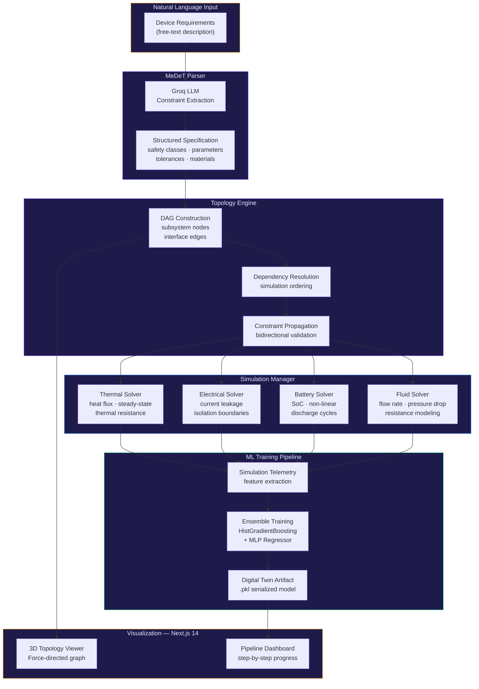

<div align="center">

# Anukriti AI — Generative System Engineering & Digital Twin Platform

**Automated pipeline: natural language device requirements → physics-simulated, ML-surrogate digital twins for medical devices**


</div>

---

## The Problem

Developing mission-critical medical devices involves a severe disconnect between how engineers describe requirements (natural language) and how those requirements get validated (physics simulations). The current workflow — manually translating specs into simulation setups, running independent solvers, and then hand-tuning surrogate models — is error-prone, slow, and doesn't scale.

Anukriti AI closes this gap with a fully automated end-to-end pipeline that parses natural language device requirements, constructs a Directed Acyclic Graph (DAG) of subsystem dependencies, runs multi-domain physics simulations, and trains a deployable ML surrogate twin — all without manual intervention.

---

## What This Does

An end-to-end generative engineering system that transforms a text description of a medical device into a physics-validated digital twin artifact.

- **LLM-driven requirement parsing** — extracts safety classes, dimensional constraints, operational tolerances, and material properties from free-text input
- **DAG topology synthesis** — maps subsystem dependencies as directed edges to resolve simulation ordering and enable bidirectional constraint propagation
- **Multi-domain physics** — thermal, electrical, battery, and fluid dynamics numerical solvers run in dependency order
- **Surrogate ML twin** — trains `HistGradientBoostingRegressor` and `MLPRegressor` ensembles on simulation telemetry and exports as `.pkl` artifacts
- **3D interactive visualization** — Force-directed graph rendering of the device topology in the browser

---

## System Architecture



---

## Tech Stack

| Layer | Technology | Role |
|:---|:---|:---|
| **Frontend** | Next.js 14 | Pipeline dashboard, 3D topology viewer |
| **Backend** | FastAPI (Python 3.9+) | REST API, pipeline orchestration |
| **LLM** | Groq SDK | Natural language parsing, constraint extraction |
| **Physics Solvers** | NumPy / SciPy | Thermal, electrical, battery, fluid simulations |
| **ML Training** | scikit-learn | HistGradientBoosting + MLP ensemble surrogate |
| **Visualization** | D3.js / Force Graph | Interactive 3D subsystem topology |
| **Serialization** | pickle (.pkl) | Digital twin artifact export |
| **Containerization** | Docker | Reproducible build and deployment |

---

## Core Capabilities

| Capability | Technical Detail |
|:---|:---|
| **Requirements Parsing** | LLM-driven translation of abstract natural language into structured JSON specifications with safety classes (IEC 62304), dimensional constraints, and material properties |
| **Constraint Extraction** | Automated derivation of operational tolerances, performance envelopes, and failure boundary conditions |
| **Topology Synthesis** | Multi-domain DAG construction — subsystems as nodes, physical/data interfaces as directed edges — with automated cycle detection |
| **Thermal Simulation** | Steady-state thermal resistance networks, heat flux propagation across multi-layer assemblies |
| **Electrical Leakage** | Current leakage modeling with isolation boundary limits per IEC 60601-1 patient contact standards |
| **Battery Discharge** | State-of-charge calculation across non-linear discharge cycles with temperature-dependent capacity curves |
| **Fluid Dynamics** | Hagen-Poiseuille flow modeling — flow rate, pressure drop, and fluidic resistance for catheter and infusion systems |
| **Surrogate Training** | Supervised learning on simulation telemetry → ensemble of `HistGradientBoostingRegressor` and `MLPRegressor` → cross-validated, serialized to `.pkl` |
| **3D Visualization** | Interactive force-directed graph of device topology with subsystem labels, dependency edges, and physics domain color-coding |

---

## Getting Started

### Prerequisites
- Python 3.9+
- Node.js 18+
- Docker (optional, for containerized deployment)
- Groq API Key

### Installation

```bash
# Clone the repository
git clone https://github.com/Hazz-Y/Anukriti-AI-Virtual-Companion.git
cd Anukriti-AI-Virtual-Companion

# Backend setup
cd backend
pip install -r requirements.txt
cp .env.example .env
# Add your GROQ_API_KEY to .env

# Start the backend
uvicorn main:app --reload --port 8000

# Frontend setup (new terminal)
cd ../frontend
npm install
npm run dev
# → http://localhost:3000
```

### Docker

```bash
docker-compose up --build
# Frontend: http://localhost:3000
# Backend:  http://localhost:8000
```

---

## Project Structure

```
Anukriti-AI-Virtual-Companion/
├── backend/                    # FastAPI server
│   ├── parsers/                # MeDeT NLP parser + constraint extractor
│   ├── topology/               # DAG engine, dependency resolver
│   ├── simulations/            # Thermal, electrical, battery, fluid solvers
│   ├── training/               # ML pipeline — feature extraction, ensemble training
│   ├── models/                 # Exported .pkl digital twin artifacts
│   └── main.py                 # FastAPI application entry
├── frontend/                   # Next.js 14 dashboard
│   ├── components/             # Topology viewer, pipeline progress, results
│   ├── pages/                  # Route-level views
│   └── public/                 # Static assets
├── docker-compose.yml
└── README.md
```

---

## License

MIT — see [LICENSE](LICENSE) for details.
